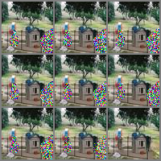
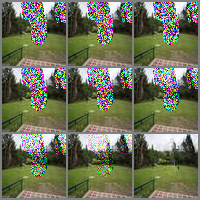

# Inpainting using diffusion models

## Brief

This project implements inpainting task on MiniPlaces dataset based on existing work from **Palette:
Image-to-Image Diffusion Models** [paper](https://arxiv.org/pdf/2111.05826.pdf) and
[GitHub repository](https://github.com/Janspiry/Palette-Image-to-Image-Diffusion-Models). In this project we perform diffusion using the following architectures:

- Simple UNet (baseline)
- Resblocks with Group normalisation and attention blocks
- ConvNeXt blocks
- Palette UNet (state-of-the-art) from [Palette repository](https://github.com/Janspiry/Palette-Image-to-Image-Diffusion-Models)

## Results

After training on 100,000 samples of MiniPlaces dataset we obtained the results displayed in the following table:

| Network                 | IS(+)  | FID(-) | PSNR(+) | SSIM(+) |
| ----------------------- | ------ | ------ | ------- | ------- |
| Baseline (Simple U-Net) | 14.397 | 68.360 | 21.340  | 0.853   |
| ConvNeXt blocks         | 14.599 | 99.085 | 21.000  | 0.847   |
| Optimised ResBlocks     | 15.050 | 44.046 | 21.218  | 0.854   |
| Palette U-Net           | 15.054 | 36.118 | 21.25   | 0.861   |
| Truth (upper bound)     | 15.893 | 0      | ∞       | 1       |

### Visuals

Results with 100 epochs and ~10 million iterations:

|  |  |
| ---------------------------------------------------------------------------- | ------------------------------------------------------------------------------ |

## Usage

### Environment

```python
pip install -r requirements.txt
```

For further details please follow the guidelines on the [Palette repository](https://github.com/Janspiry/Palette-Image-to-Image-Diffusion-Models).

## Acknowledge

Our work is based on the following works:

- [Palette: Image-to-Image Diffusion Models Paper](https://arxiv.org/pdf/2111.05826.pdf)
- [Palette: Image-to-Image Diffusion Models Project](https://github.com/Janspiry/Palette-Image-to-Image-Diffusion-Models)
